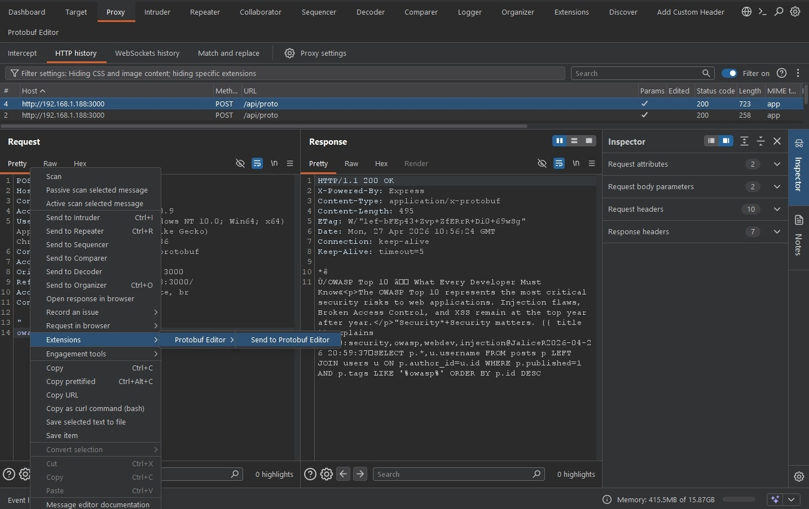
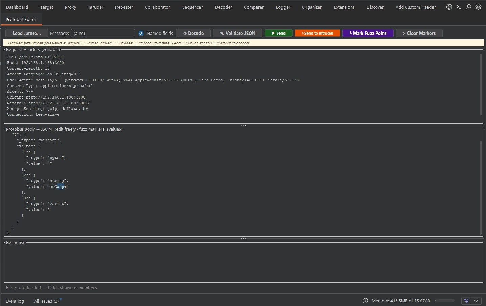
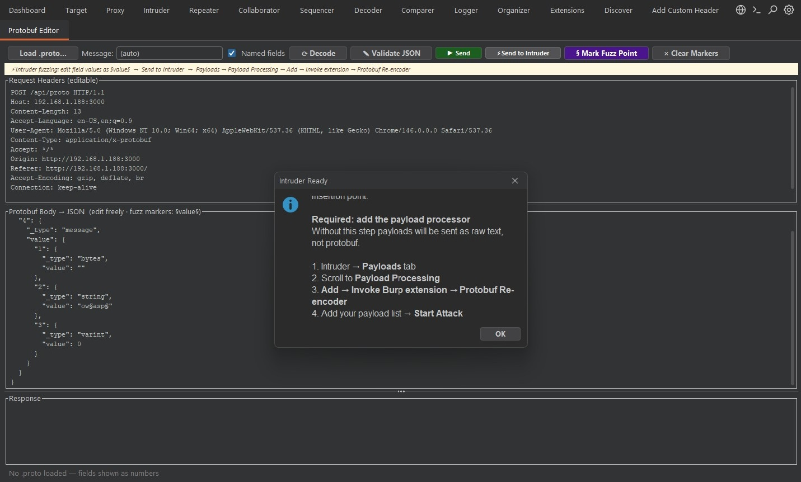
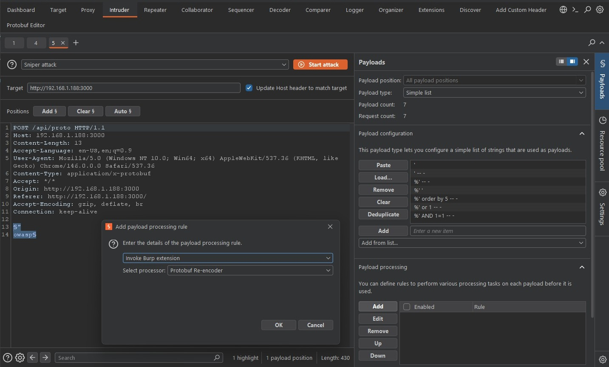
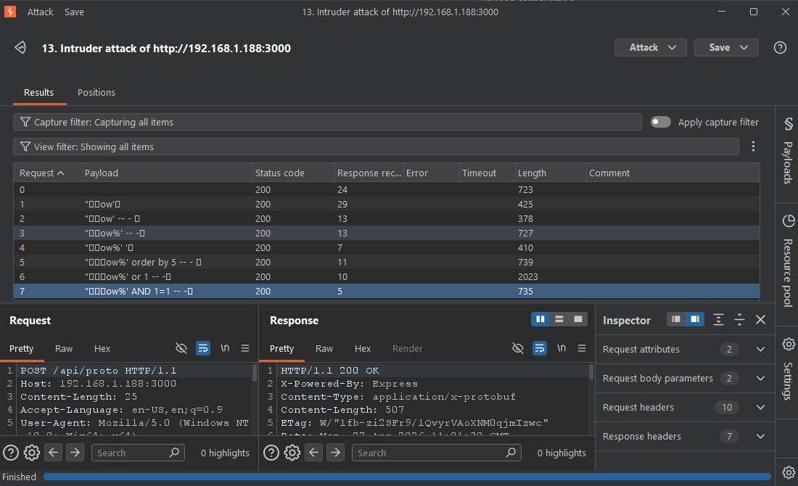

# Protobuf Editor Burp Suite Extension

The Protobuf Editor is a Burp Suite extension designed to simplify the testing of applications using Google Protocol Buffers (Protobuf). It allows users to view, edit, and fuzz Protobuf-encoded messages by converting them into a manageable JSON format.

## Features

- **Binary to JSON Conversion**: Automatically decodes Protobuf binary data into JSON for easy reading and editing.
- **Protobuf Re-encoding**: Re-encodes modified JSON back into valid Protobuf binary before sending the request.
- **Intruder Integration**: Supports fuzzing Protobuf fields using Burp Intruder by providing a dedicated re-encoding payload processor.
- **Manual Editor Tab**: A dedicated "Protobuf Editor" tab for manual manipulation and sending of requests.

## Usage Instructions

### 1. Sending Requests to the Editor
Locate a request containing Protobuf data (usually identified by the `application/x-protobuf` Content-Type) in your HTTP history. Right-click the request and select **Extensions > Protobuf Editor > Send to Protobuf Editor**.

### 2. Editing and Sending
In the **Protobuf Editor** tab, you can view the headers and the body. The body is presented in JSON format. You can modify the values directly in the JSON structure. Once modified, click **Send** to dispatch the request.

### 3. Fuzzing with Intruder
To fuzz specific fields within a Protobuf message:
1. Highlight the value you wish to fuzz in the JSON body.
2. Click **Mark Fuzz Point**.
3. Click **Send to Intruder**.
4. A popup will remind you to configure the payload processor.

### 4. Configuring the Payload Processor
In the Burp Intruder **Payloads** tab:
1. Under the **Payload processing** section, click **Add**.
2. Select **Invoke Burp extension** from the dropdown.
3. Select **Protobuf Re-encoder** as the processor.
This step ensures that your cleartext payloads are properly encoded back into binary Protobuf format during the attack.

### 5. Analyzing Results
After starting the Intruder attack, the extension handles the encoding of each payload. You can monitor the responses in the Intruder results table as usual.

## Requirements
- Burp Suite Professional or Community Edition.
- Java Runtime Environment compatible with your Burp installation.

## Installation
1. Download the extension JAR file.
2. In Burp Suite, go to the **Extensions** tab.
3. Click **Add** and select the JAR file.
4. The "Protobuf Editor" tab should now appear in your main Burp UI.
